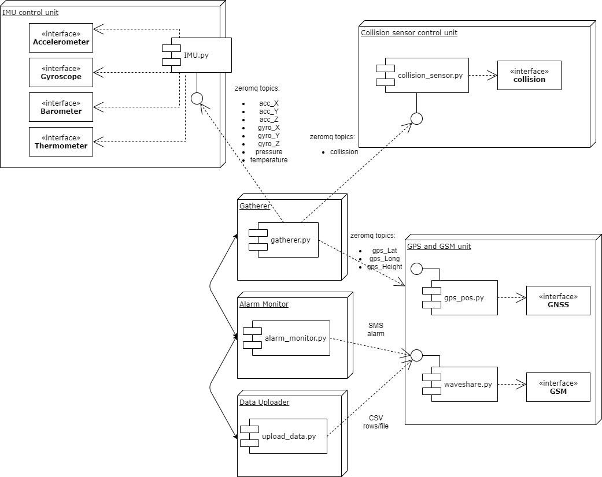

# BlackBox repository

1. We can run ROS2 on Raspberry Pi Zero WH (even with 512 MB Ram), but it's an overkill to me
2. I chose ZeroMQ over RabbitMQ (no overhead with installing extra library). Just a regular
   Python3 library installation using pip    :wq
3. Do we want a CI with some static analysis tools? I know how to play with Github Actions etc.

### Run the code

The only code available to run is example_publisher.py and example_subscriber.py.
I have used it to virtually test if ZeroMQ IPC lib will work on Raspbian. I would not bother with
serialization/deserialization, but if you find it different, then let's go for gRPC and .proto.

### Architecture

Simple graphs done in https://app.diagrams.net/#HAeolusTech%2FBlackBox%2Fmaster%2Fblackbox

If you want to draw something, you can link the repository, and it will automatically
commit the .xml files even.

by Pandora Avionics